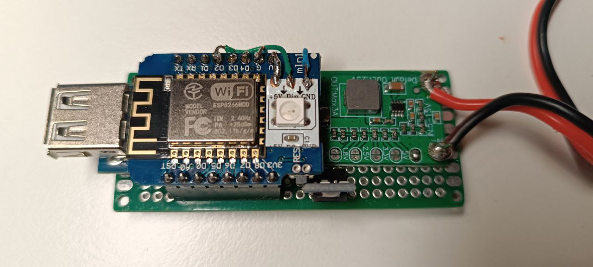
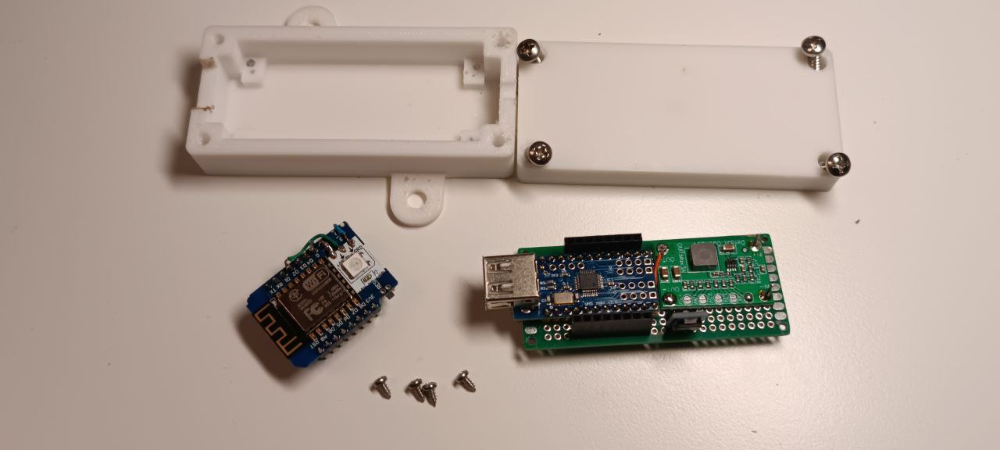
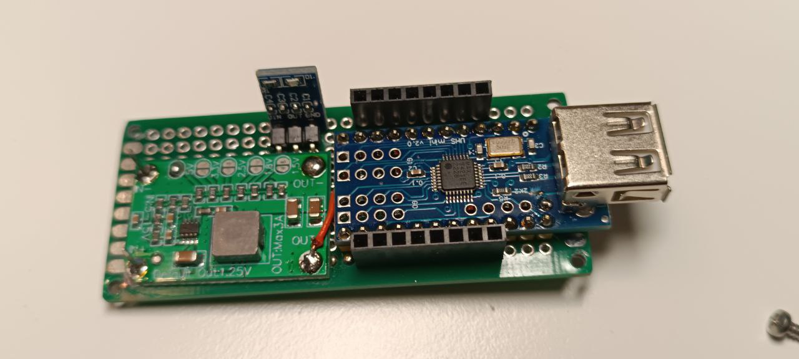
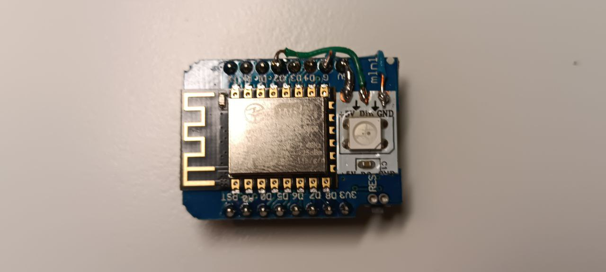

NMEA0183USB-Wifi-bridge on ESP8266 microcontroller
  
</td>

The idea behind the project is to use perhaps the cheapest Matsutec AR-10 AIS receiver on the market to transmit NMEA messages to Navionics. Navionics perfectly supports receiving messages via a Wifi network. The device is a bridge between the Matsutec AR-10 (or any other USB device running on the CH340 chip) and WiFi. In addition, NMEA messages received from USB are duplicated into the USB port of the microcontroller board; the device can be connected to a computer to transmit messages to, for example, OpenCPN. Also, messages coming to the USB of the microcontroller are sent to WiFI.

The project code is based on the code of the following projects:

https://github.com/alvra/nmea-bridge - read the annotation to understand all the capabilities of the device.
https://github.com/UNBIduino/USBHostSeildWithCH340 - driver for CH340 chip

To assemble the device, no special knowledge or skills in electronics are required. The device is assembled from ready-made components:
1. ESP8266 WeMos D1 Mini V2 (ESP-12)
2. Mini USB Host Shield
3. Power converter 12-5v TZT 3A
4. Power converter 5-3.3v GSMIN AMS1117 800mA
5. Breadboard 3x7cm
6. Optional: 1 addressable LED WS2812B or similar
7. 4 screws 2.2x4.5 fastening the board, 4 screws 4.5x20 for the case

</td>
 
Connection diagram here:
https://oshwlab.com/aleck1/new-project
Please note the following during assembly:
* it is necessary to supply 5v power to the VBUS pin of the Mini USB Host Shield board, otherwise the AR-10 will not work. Most likely, to do this, you need to cut the track going to the VBUS pin and solder the conductor to the 5v power supply directly to the pin. Read more about the problem and its solution here: https://www.hackster.io/usini/plug-any-usb-device-on-an-esp8266-e0ca8a (Fix Powering Issues)
* Mini USB Host Shield is placed asymmetrically on a 3x7cm breadboard. I recommend moving it one row to the right. This will provide more space for conductors to WEMOS. The case is also designed with this displacement in mind.
* In order for everything to fit on a 3x7cm breadboard, the Mini USB Host Shield must be placed on the first row of the board
</td>
* The ESP8266 WeMos D1 Mini microcontroller is placed ABOVE the Mini USB Host board on a high comb starting from the 4th row. Typically this comb comes with WeMos D1
* Although the device works without a 5-3.3v power converter, it is still better to use it, because the WEMOS power on the 3.3v pin may not be enough for stable operation

An optional WS2812B addressable LED is used to provide better visibility into device operating status. It can be glued directly to the WeMos D1 board, control pin D2. It signals the following:
* red: USB initialization or reading error
* blue: double blinking every 15 seconds - working in access point mode, single blinking - working in wifi client mode, constantly on - wifi initialization error
* green: NMEA message received and processed via USB
</td>
  

You can do without an addressable LED. In this case, the indication is by the built-in LED: double blinking every 15 seconds - working in access point mode, single blinking - working in wifi client mode, constantly lit - wifi initialization error. Be sure to comment out (delete) the line in the sketch #define RGB_LED to enable indication mode with built-in LED.

Please note: The current version does not support hot plugging of the AR-10 to USB. AIS must be connected before the device is powered on.

Case layout for printing on a 3D printer in the Box_design catalog. Ears are provided for surface mounting.
